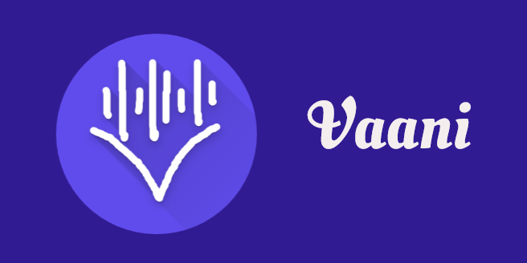
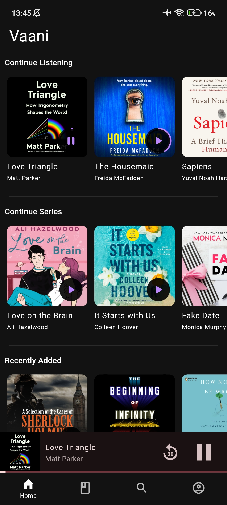
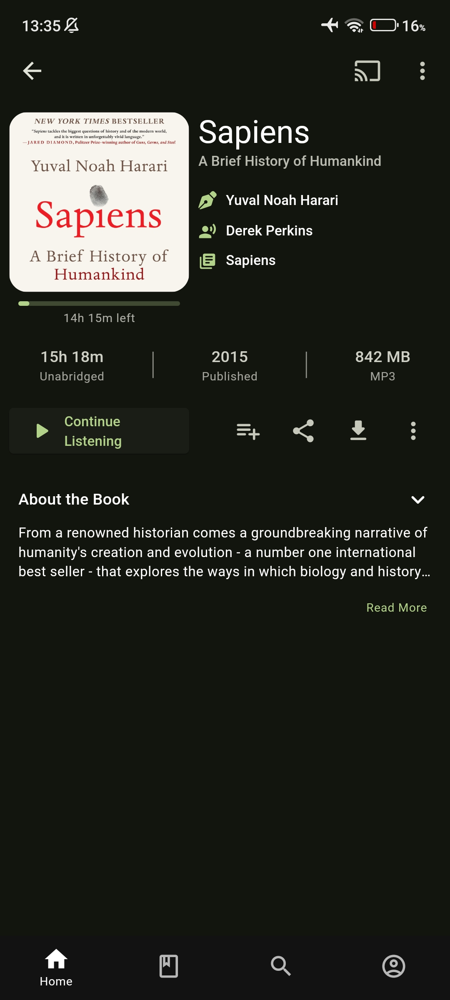
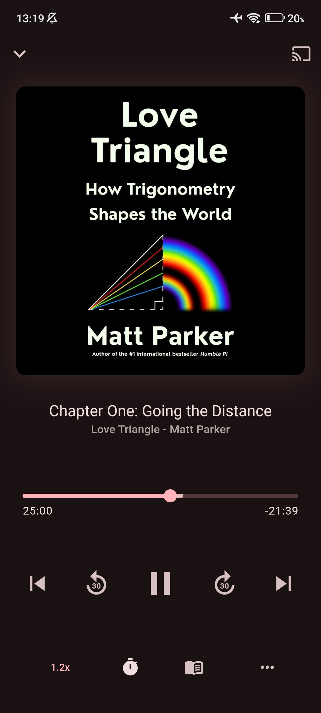

   

# Vaani

Client for [Audiobookshelf](https://github.com/advplyr/audiobookshelf) server made with Flutter.

## Features

* Functional Player: Speed Control, Sleep Timer, Shake to Control Player
* Save data with Offline listening and caching
* Material Design
* Extensive Settings to customize the every tiny detail

## Download

### Android

<!-- a github image with link to releases for download -->
 

 
 

*<small>Play Store version is paid if you want to support the development.</small>*

## Screencaps

https://github.com/user-attachments/assets/2ac9ace2-4a3c-40fc-adde-55914e4cf62d

|  |  |  |
| :-----------------------------------------------------------: | :---------------------------------------------------------------: | :-------------------------------------------------------------: |
|                             Home                              |                             Book View                             |                             Player                              |

Currently, the app is in development and is not ready for production use.

Plan is to have support for android, and desktop.
